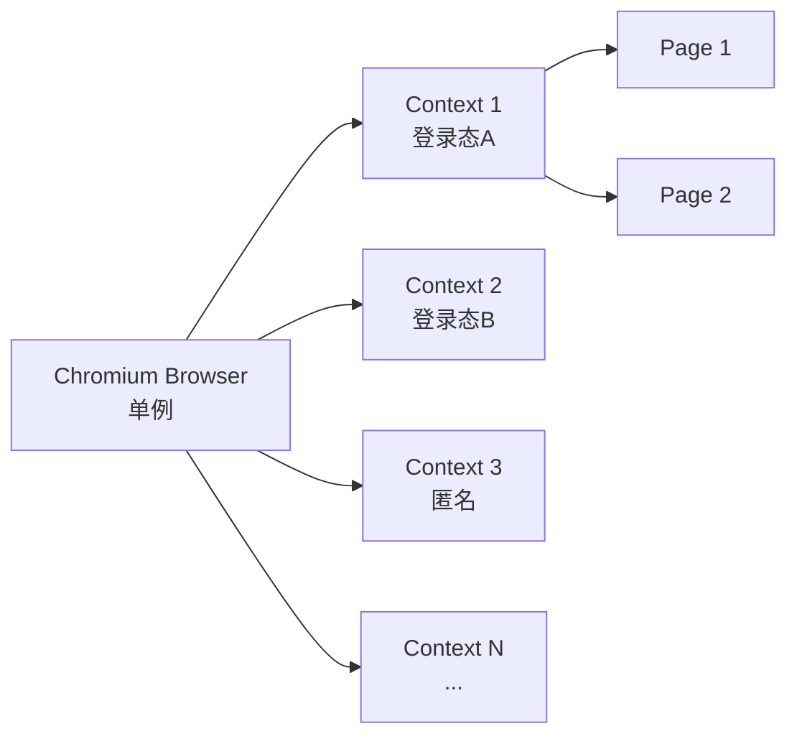

# 浏览器上下文池

BrowserContextPool 是 OmniData 的核心组件之一，以 **单 Browser + 按命名空间缓存 Context** 的架构实现 7×24 稳定运行，并内置浏览器自愈机制，对用户完全透明。

---

## 架构设计

### 单 Browser + 多 Context



**设计优势**：
- **内存高效**：多 Context 共享同一个 Browser 进程
- **状态隔离**：每个 Context 拥有独立的 Cookie、Storage、Session
- **并行执行**：多个 Context 可同时执行任务

---

## 核心机制（7×24 内核级稳定）

以下策略均为内核固定值（`BrowserContextPool` 类常量），**不对外配置**，对用户透明：

### 1. 按命名空间缓存 Context

- 每个命名空间（数据源）持有一个常驻 Context 复用
- 命名空间数量由 `data_sources/` 目录天然决定，**无容量限制**
- Context 空闲 **10 分钟**自动回收，内存不累积

### 2. 浏览器整体回收（根治长跑内存增长）

后台维护任务（每分钟检查一次）按以下条件判定回收：

| 条件 | 阈值 | 说明 |
| :--- | :--- | :--- |
| 存活时间 | **8 小时** | 两次回收之间最大存活时长 |
| 累计建页数 | **5000 次** | 两次回收之间累计创建 Page 上限 |

任一条件先到即触发浏览器整体回收：

- 在 **空闲窗口**（无在途请求，`active_pages == 0`）执行
- 关闭全部 Context + Browser 后重启，重置回收计数
- 连续 **16 小时**无空闲窗口才强制执行（不允许再等）

### 3. 自愈覆盖两层

| 故障 | 自愈行为 |
| :--- | :--- |
| 浏览器崩溃（断连） | 自动重启 Browser |
| launch 失败（驱动死亡/OOM） | 整体重建 Playwright 驱动后重试 |

### 4. 登录态自动恢复

- 登录态（Cookies + LocalStorage）持久化于 Redis，**无 TTL**
- 浏览器回收/重启后，`get_context()` 从 Redis 自动恢复，对上层无感
- shutdown 后拒绝复活，避免并发请求重新拉起浏览器留下孤儿进程

---

## 使用方式

### 在爬虫中使用

```python
class MySpider(BaseWebSpider):
    async def crawl(self, params: MyParams) -> SpiderResult:
        # 方式1：自动管理 Page（推荐）
        # namespace 为平台中文名，对应 data_sources/ 下的目录名
        async with self.new_page(namespace="东方财富") as page:
            await page.goto("https://example.com")
            return SpiderResult(success=True, data={...})

        # 方式2：手动获取 Context（Context 生命周期由池自动管理，
        # 用户无需也不应手动 close context）
        context = await self.get_context(namespace="东方财富")
        page = await context.new_page()
        ...
```

### 反检测策略

`new_page()` 支持反检测脚本策略：

```python
# 预设策略：basic / standard / advanced（默认 advanced）
async with self.new_page(namespace="东方财富", anti_crawling_strategy="advanced") as page:
    ...

# 或指定单个/多个脚本名称
async with self.new_page(namespace="东方财富", anti_crawling_strategy=["stealth", "webgl"]) as page:
    ...
```

---

## 配置项

浏览器配置通过环境变量设置：

```bash
# 浏览器配置
OMNIDATA_BROWSER__HEADLESS=true                    # 无头模式
OMNIDATA_BROWSER__DEFAULT_TIMEOUT=8000             # 操作超时（毫秒）
```

!!! note "内部稳定机制"
    Context 池容量、空闲回收、浏览器整体回收、自愈策略等均为内核固定策略，
    **不提供对外配置**，避免误调导致稳定性问题。

---

## 监控指标

通过监控接口获取实时状态：

### 浏览器池统计

```http
GET /api/v1/monitor/browser-pool
```

**响应示例**（统一 `ApiResponse` 包装）：

```json
{
  "success": true,
  "message": "获取浏览器池状态成功",
  "data": {
    "browser_count": 1,
    "context_count": 5,
    "active_pages": 2,
    "total_contexts_created": 120,
    "total_contexts_reused": 480,
    "reuse_rate": 0.8,
    "total_contexts_closed": 100,
    "total_browser_recycles": 3,
    "total_browser_recoveries": 1,
    "pages_since_recycle": 1234,
    "last_recycle_at": 1752552000.0,
    "config": {
      "idle_timeout": 600,
      "headless": true,
      "user_agent": "Mozilla/5.0 ... Chrome/143.0.0.0 Safari/537.36"
    }
  }
}
```

### Context 列表

```http
GET /api/v1/monitor/contexts
```

返回每个 Context 的命名空间、创建/最后使用时间、空闲时长与页数。

---

## 最佳实践

1. **使用命名空间**：为不同用途使用不同的 namespace（平台中文名即可）
2. **及时释放**：使用 `async with` 自动管理 Page 生命周期
3. **复用登录态**：登录后保存 Context，后续请求自动复用
4. **监控资源**：定期查看 `/api/v1/monitor/browser-pool`，关注回收/自愈计数

---

详见：
- [系统架构概览](overview.md)
- [爬虫生命周期](spider-lifecycle.md)
