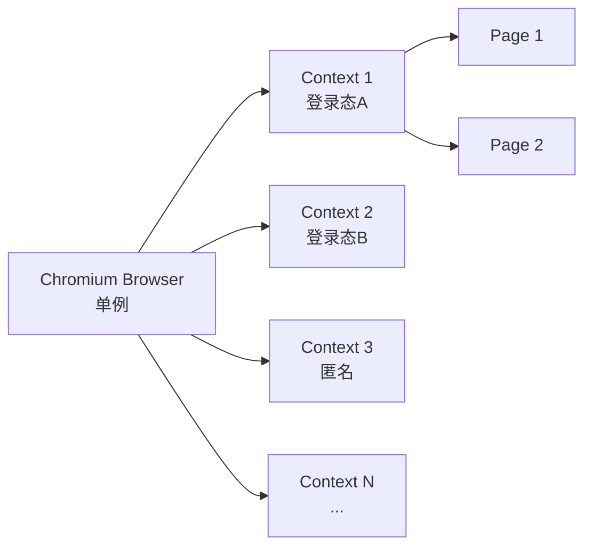

# 浏览器上下文池

BrowserContextPool 是 OmniData 的核心组件之一，负责高效管理浏览器资源。

---

## 架构设计

### 单 Browser + 多 Context



**设计优势**：
- **内存高效**：多 Context 共享同一个 Browser 进程
- **状态隔离**：每个 Context 拥有独立的 Cookie、Storage、Session
- **并行执行**：多个 Context 可同时执行任务

---

## 核心功能

### 1. LRU 缓存策略

```python
class BrowserContextPool:
    def __init__(self, max_size: int = 10):
        self._cache = LRUCache(max_size=max_size)
```

- **最大容量**：默认 10 个 Context
- **淘汰策略**：最少使用优先淘汰
- **空闲超时**：5 分钟未使用自动清理

### 2. 状态持久化

```python
# 保存状态到 Redis
await pool.save_context_state(context, namespace="user_a")

# 从 Redis 恢复状态
context = await pool.get_or_create_context(namespace="user_a")
```

**存储内容**：
- Cookies
- LocalStorage
- SessionStorage

### 3. 健康检查

定期检查 Context 健康状态，自动清理失效实例。

```python
async def _health_check_loop(self):
    while True:
        await asyncio.sleep(60)
        await self._cleanup_stale_contexts()
```

---

## 使用方式

### 在爬虫中使用

```python
class MySpider(BaseWebSpider):
    async def crawl(self, params: MyParams) -> SpiderResult:
        # 方式1：自动管理 Page（推荐）
        async with self.new_page(namespace="my_namespace") as page:
            await page.goto("https://example.com")
            return SpiderResult(success=True, data={...})

        # 方式2：手动管理
        context = await self.get_context(namespace="my_namespace")
        page = await context.new_page()
        try:
            await page.goto("https://example.com")
            return SpiderResult(success=True, data={...})
        finally:
            await page.close()
```

### 命名空间规范

| 命名空间 | 用途 | 生命周期 |
| :--- | :--- | :--- |
| `spider_{name}` | 爬虫通用上下文 | 长期 |
| `login_{platform}` | 登录态保持 | 长期 |
| `task_{task_id}` | 临时任务 | 任务结束 |

---

## 配置项

通过环境变量配置：

```bash
# 浏览器配置
OMNIDATA_BROWSER__HEADLESS=true                    # 无头模式
OMNIDATA_BROWSER__CONTEXT_POOL_MAX_SIZE=10         # 最大 Context 数量
OMNIDATA_BROWSER__CONTEXT_POOL_IDLE_TIMEOUT=300    # 空闲超时（秒）

# 健康检查
OMNIDATA_BROWSER__HEALTH_CHECK_INTERVAL=60         # 健康检查间隔（秒）
OMNIDATA_BROWSER__HEALTH_CHECK_TIMEOUT=30          # 健康检查超时（秒）
```

---

## 监控指标

通过 `/monitor/browser-pool` 获取实时状态：

```json
{
  "total_contexts": 5,
  "active_contexts": 3,
  "idle_contexts": 2,
  "cache_stats": {
    "hits": 120,
    "misses": 15,
    "hit_rate": 0.889
  },
  "contexts": [
    {
      "namespace": "eastmoney_login",
      "created_at": "2026-02-11T10:00:00",
      "last_used_at": "2026-02-11T10:30:00",
      "page_count": 0,
      "status": "idle"
    }
  ]
}
```

---

## 最佳实践

1. **使用命名空间**：为不同用途使用不同的 namespace
2. **及时释放**：使用 `async with` 自动管理 Page 生命周期
3. **复用登录态**：登录后保存 Context，后续请求复用
4. **监控资源**：定期检查池状态，避免资源泄漏

---

详见：
- [系统架构概览](overview.md)
- [爬虫生命周期](spider-lifecycle.md)
