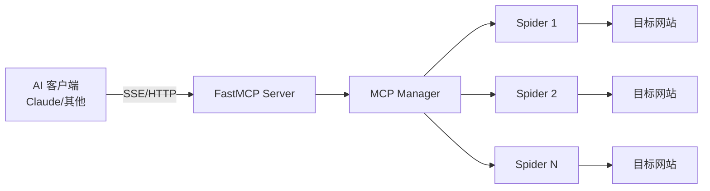

# MCP 集成

OmniData 原生支持 Model Context Protocol (MCP)，可动态创建 MCP 服务。

---

## MCP 架构



---

## 核心概念

### MCP 服务

将一个或多个爬虫暴露为 MCP 工具（Tools）。

```json
{
  "name": "financial-data",
  "description": "金融数据查询服务",
  "spider_names": [
    "eastmoney_stock_quote",
    "eastmoney_market_flow"
  ],
  "transport": "streamable-http"
}
```

### 工具映射

每个爬虫对应一个 MCP 工具：

| 爬虫名称 | MCP 工具名称 | 描述 |
| :--- | :--- | :--- |
| `eastmoney_stock_quote` | `get_stock_quote` | 获取股票行情 |
| `sina_global_news` | `get_global_news` | 获取全球新闻 |

---

## 创建 MCP 服务

### 通过 API

```bash
curl -X POST http://localhost:8380/api/v1/mcp-services \
  -H "Content-Type: application/json" \
  -d '{
    "name": "my-finance",
    "description": "我的金融数据服务",
    "spider_names": ["eastmoney_stock_quote", "eastmoney_market_flow"],
    "transport": "streamable-http"
  }'
```

### 通过 Web 界面

1. 访问 `http://localhost:5173`
2. 进入「MCP 服务管理」
3. 选择爬虫，配置参数
4. 创建服务

---

## 传输协议

### 1. HTTP

```json
{
  "transport": "http"
}
```

- 标准HTTP请求/响应
- 适合快速查询场景

### 2. Streamable HTTP

```json
{
  "transport": "streamable-http"
}
```

- 支持流式响应
- 适合大批量数据

### 3. SSE

```json
{
  "transport": "sse"
}
```

- Server-Sent Events
- 适合实时推送

---

## 客户端连接

### Claude Desktop 配置

```json
{
  "mcpServers": {
    "omnidata": {
      "url": "http://localhost:8380/mcp/financial-data",
      "transport": "sse"
    }
  }
}
```

### Python 客户端

```python
from anthropic import Anthropic

client = Anthropic()

response = client.messages.create(
    model="claude-sonnet-4-20250514",
    max_tokens=1024,
    tools=[
        {
            "type": "function",
            "name": "get_stock_quote",
            "description": "获取股票实时行情",
            "input_schema": {
                "type": "object",
                "properties": {
                    "secucode": {"type": "string"}
                }
            }
        }
    ],
    messages=[{
        "role": "user",
        "content": "查询000001的股价"
    }]
)
```

---

## 自定义工具提示

为每个爬虫工具自定义 AI 提示词：

```bash
# 获取工具提示
GET /api/v1/mcp-services/{id}/prompts

# 更新工具提示
PUT /api/v1/mcp-services/{id}/tools/{tool_id}/prompt
{
  "user_prompt": "你是股票查询助手，帮助用户获取实时股价..."
}
```

---

## 路由规则

MCP 服务挂载路径：

```
/mcp/{service_name}
```

示例：
- 服务名：`financial-data`
- 访问路径：`http://localhost:8380/mcp/financial-data`

---

## 管理接口

### 列出服务

```bash
GET /api/v1/mcp-services
```

### 获取服务详情

```bash
GET /api/v1/mcp-services/{id}
```

### 删除服务

```bash
DELETE /api/v1/mcp-services/{id}
```

---

## 最佳实践

1. **服务命名**：使用描述性名称，如 `financial-data` 而非 `service1`
2. **工具描述**：为每个工具编写清晰的描述，帮助 AI 理解用途
3. **参数验证**：利用 Pydantic 验证，确保 MCP 请求参数正确
4. **版本管理**：支持多版本提示，适应不同 AI 模型

---

详见：
- [系统架构概览](overview.md)
- [API 参考](../api/mcp.md)
