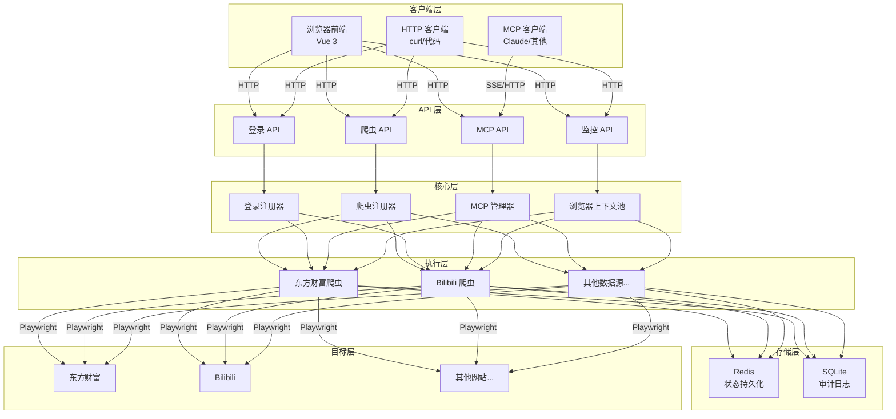
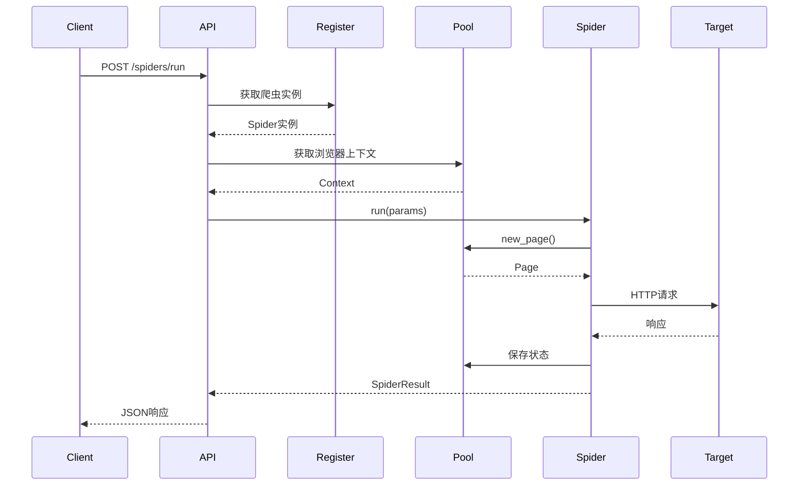

# 系统架构概览

OmniData 采用模块化设计，各组件职责清晰，便于扩展和维护。

---

## 整体架构



---

## 核心组件

### 1. 爬虫注册器 (SpiderRegister)

自动发现和管理所有爬虫实例。

- **扫描路径**：`omnidata/data_sources/`
- **扫描规则**：继承 `BaseWebSpider` 的类
- **命名约定**：`{platform}_{action}`

### 2. 登录注册器 (LoginRegister)

自动发现和管理所有登录模块。

- **扫描路径**：`omnidata/data_sources/{platform}/login.py`
- **扫描规则**：继承 `BaseQRLogin` 的类
- **状态管理**：Redis 持久化

### 3. 浏览器上下文池 (BrowserContextPool)

单 Browser + 多 Context 架构。

- **单例模式**：全局唯一的浏览器实例
- **LRU 缓存**：自动清理最久未使用的 Context
- **状态恢复**：从 Redis 恢复登录状态

### 4. MCP 管理器 (MCPManager)

管理 MCP 服务的生命周期。

- **动态创建**：根据选中的爬虫创建服务
- **多协议支持**：http、streamable-http、sse
- **路由管理**：`/mcp/{service_name}`

---

## 数据流

### 爬虫执行流程



---

## 设计原则

1. **约定优于配置**：通过目录结构和命名约定实现零配置
2. **单一职责**：每个类只负责一个功能
3. **依赖注入**：通过参数传递依赖，便于测试
4. **状态分离**：无状态 API + 有状态存储（Redis）
5. **可观测性**：审计日志记录所有操作

---

## 扩展性

### 添加新数据源

只需在 `data_sources/` 下创建新目录和爬虫文件：

```
omnidata/data_sources/myplatform/
├── __init__.py
├── spider.py          # 爬虫实现
└── login.py           # 登录实现（可选）
```

### 添加新功能

核心组件支持独立扩展：

- 新增存储后端：继承抽象基类
- 新增传输协议：扩展 MCP 管理器
- 新增反检测策略：更新 Playwright 脚本

---

详见：
- [浏览器池设计](browser-pool.md)
- [爬虫生命周期](spider-lifecycle.md)
- [MCP 集成](mcp-integration.md)
- [数据库设计](database.md)
