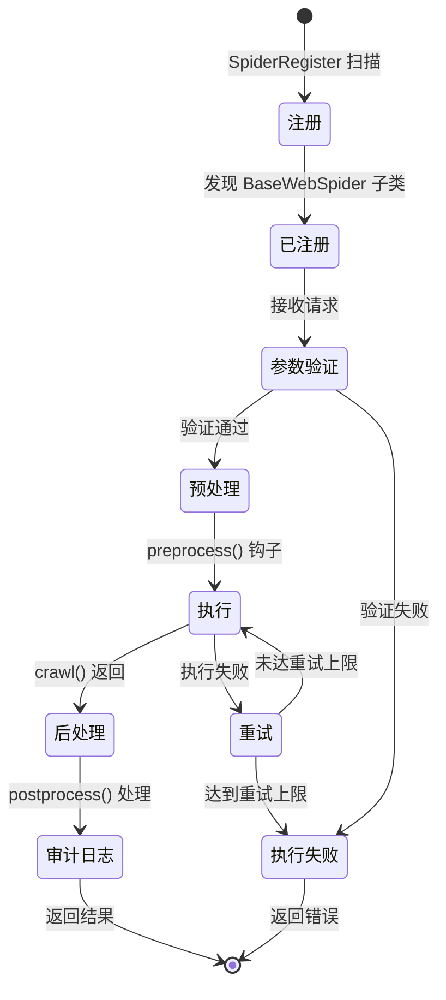

# 爬虫生命周期

了解爬虫从创建到执行的完整生命周期。

---

## 生命周期流程



---

## 1. 注册阶段

### 自动发现

```python
# omnidata/core/spider_register.py

class SpiderRegister:
    def _discover_spiders(self):
        """扫描 data_sources/ 目录"""
        for file_path in Path("omnidata/data_sources").rglob("*.py"):
            module = self._load_module(file_path)
            for item in module.__dict__.values():
                if self._is_spider_class(item):
                    self._register(item)
```

### 命名约定

爬虫类命名格式：`{Platform}{Action}Spider`

| 类名 | spider_name | 平台 | 动作 |
| :--- | :--- | :--- | :--- |
| `EastmoneyStockQuoteSpider` | `eastmoney_stock_quote` | 东方财富 | 股票行情 |
| `SinaGlobalNewsSpider` | `sina_global_news` | 新浪 | 全球新闻 |

---

## 2. 参数验证阶段

### Pydantic 模型

```python
from pydantic import BaseModel, Field

class StockQuoteParams(BaseModel):
    secucode: str = Field(..., description="股票代码", min_length=6, max_length=9)
    fields: list[str] = Field(default=["name", "price"], description="返回字段")
```

### 自动验证

```python
async def run(self, params: dict) -> SpiderResult:
    # 自动验证并转换
    validated_params = self.params_model(**params)
    return await self.crawl(validated_params)
```

---

## 3. 预处理阶段

### 钩子方法

```python
class MySpider(BaseWebSpider):
    async def preprocess(self, params: MyParams) -> MyParams:
        """在执行前修改或增强参数"""
        # 示例：添加时间戳
        params.timestamp = int(time.time())
        return params
```

---

## 4. 执行阶段

### 核心方法

```python
async def crawl(self, params: MyParams) -> SpiderResult:
    """爬虫核心逻辑，必须实现"""
    async with self.new_page(namespace=f"spider_{self.name}") as page:
        await page.goto(url)

        data = await self._extract_data(page)

        return SpiderResult(
            success=True,
            data=data,
            metadata={"url": page.url}
        )
```

### 重试机制

```python
async def run(self, params: dict) -> SpiderResult:
    for attempt in range(self.retry_times):
        try:
            return await self._execute_with_lifecycle(params)
        except Exception as e:
            if attempt == self.retry_times - 1:
                raise
            await asyncio.sleep(self.retry_delay * (2 ** attempt))
```

---

## 5. 后处理阶段

### 结果处理

```python
async def postprocess(self, result: SpiderResult) -> SpiderResult:
    """处理爬虫返回结果"""
    # 示例：数据清洗
    if result.data:
        result.data = self._clean_data(result.data)
    return result
```

---

## 6. 审计日志

### 自动记录

```python
async def _log_audit(self, spider_name: str, params: dict, result: SpiderResult):
    """记录到 SQLite"""
    await SpiderAudit.create(
        spider_name=spider_name,
        params=json.dumps(params),
        status="success" if result.success else "failed",
        execution_time=result.execution_time,
        error_message=result.error
    )
```

---

## SpiderResult 结构

```python
@dataclass
class SpiderResult:
    success: bool                    # 是否成功
    data: Any = None                 # 返回数据
    metadata: dict = field(default_factory=dict)  # 元数据
    error: str | None = None         # 错误信息
    execution_time: float = 0.0      # 执行耗时（秒）
```

---

## 最佳实践

1. **参数验证**：使用 Pydantic 模型定义严格的参数规则
2. **错误处理**：在 `crawl()` 中捕获并处理预期异常
3. **元数据**：在 `metadata` 中返回调试信息
4. **幂等性**：相同参数应返回相同结果

---

详见：
- [系统架构概览](overview.md)
- [浏览器池设计](browser-pool.md)
- [创建爬虫指南](../development/creating-spider.md)
