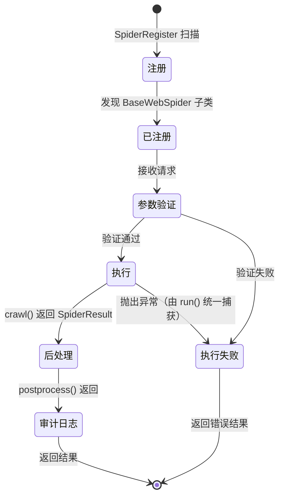

# 爬虫生命周期

了解爬虫从创建到执行的完整生命周期。

---

## 生命周期流程



---

## 1. 注册阶段

### 自动发现

```python
# omnidata/core/spider_register.py
class SpiderRegister:
    def _discover_spiders(self):
        """扫描 data_sources/ 目录"""
        for file_path in Path("omnidata/data_sources").rglob("*.py"):
            module = self._load_module(file_path)
            for item in module.__dict__.values():
                if self._is_spider_class(item):
                    self._register(item)
```

### 命名约定

爬虫 `name` 属性格式：`{数据源}_{功能描述}`

| name | 平台 | 动作 |
| :--- | :--- | :--- |
| `eastmoney_stock_quote` | 东方财富 | 股票行情 |
| `sina_global_news` | 新浪 | 全球新闻 |

---

## 2. 参数验证阶段

### Pydantic 模型

```python
from pydantic import BaseModel, Field

class StockQuoteParams(BaseModel):
    secucode: str = Field(..., description="股票代码", min_length=6, max_length=9)
    fields: list[str] = Field(default=["name", "price"], description="返回字段")
```

### 自动验证

`run()` 通过 `params_model.model_validate(params)` 自动验证并转换参数：

```python
async def run(self, params: dict) -> SpiderResult:
    # 自动验证并转换
    validated_params = self.params_model.model_validate(params)
    result = await self.crawl(validated_params)
    final_result = await self.postprocess(result, validated_params)
    # 设置 spider_name 和时间字段，记录审计日志
    ...
```

---

## 3. 执行阶段

### 核心方法

```python
async def crawl(self, params: MyParams) -> SpiderResult:
    """爬虫核心逻辑，必须实现"""
    async with self.new_page(namespace="东方财富") as page:
        await page.goto(url)

        data = await self._extract_data(page)

        return SpiderResult(
            success=True,
            data=data,
            metadata={"url": page.url},
        )
```

### 异常处理

`crawl()` 中**无需自行 try/except**——抛出的异常会被 `run()` 统一捕获并记录 traceback，包装为 `success=False` 的错误结果，同时记录审计日志。

---

## 4. 后处理阶段

### 结果处理

```python
async def postprocess(self, result: SpiderResult, params: MyParams) -> SpiderResult:
    """处理爬虫返回结果（可选，接收并返回 SpiderResult）"""
    # 示例：数据清洗
    if result.data:
        result.data = self._clean_data(result.data)
    return result
```

注意：`postprocess` 的签名是 `(result, params)`，两个参数都是必传的。

---

## 5. 审计日志

每次爬虫执行（含成功与失败）都会自动记录到 SQLite：

- `spider_name`、`platform`、`spider_version`
- `success`、`error_message`
- `started_at`、`completed_at`、`duration_seconds`
- `params`、`result_metadata`（JSON）

审计记录失败不会影响爬虫执行，仅记录 warning 日志。

---

## SpiderResult 结构

```python
@dataclass
class SpiderResult:
    success: bool = True                 # 是否成功
    data: Any = None                     # 返回数据
    metadata: dict = field(default_factory=dict)  # 元数据
    message: str | None = None           # 错误信息（success=False 时）
    # 以下字段由 run() 自动设置，开发者无需关注
    spider_name: str | None = None
    started_at: datetime = ...
    completed_at: datetime | None = None
    duration_seconds: float = 0
```

!!! warning "不要手动设置时间字段"
    `spider_name`、`started_at`、`completed_at`、`duration_seconds` 会自动被 `run()` 覆盖，
    开发者只关注 `success` / `data` / `metadata` / `message` 即可。

---

## 最佳实践

1. **参数验证**：使用 Pydantic 模型定义严格的参数规则
2. **错误处理**：直接在 `crawl()` 中抛出异常，由 `run()` 统一处理
3. **元数据**：在 `metadata` 中返回调试信息
4. **幂等性**：相同参数应返回相同结果

---

详见：
- [系统架构概览](overview.md)
- [浏览器池设计](browser-pool.md)
- [创建爬虫指南](../development/creating-spider.md)
