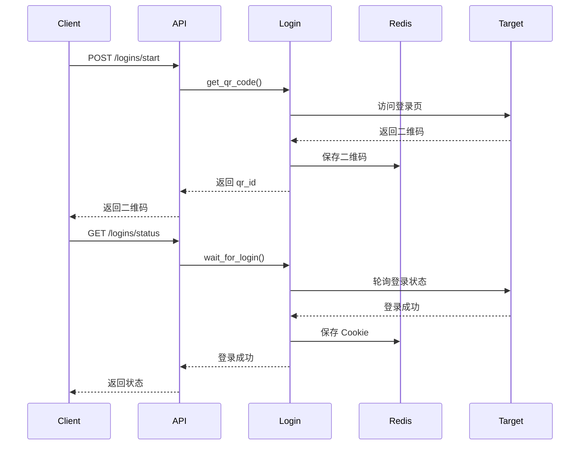

# 添加登录

为需要登录的网站添加二维码登录支持。

---

## 登录基类

继承 `BaseQRLogin` 创建登录模块：

```python
# omnidata/data_sources/myplatform/login.py
from omnidata.core.base_qr_login import BaseQRLogin

class MyPlatformLogin(BaseQRLogin):
    """我的平台登录"""

    # 基本信息
    name = "myplatform"           # 登录名称（对应平台）
    description = "我的平台登录"
    version = "1.0.0"
    author = "your_name"
    platform = "我的平台"

    async def get_qr_code(self) -> str:
        """获取二维码"""
        async with self.new_page() as page:
            await page.goto("https://example.com/login")

            # 等待二维码出现
            await page.wait_for_selector(".qrcode img")

            # 获取二维码图片
            qr_img = await page.locator(".qrcode img").screenshot()

            # 保存到 Redis
            qr_id = await self.save_qr_code(qr_img)

            return qr_id

    async def wait_for_login(self) -> dict:
        """等待用户扫码登录"""
        async with self.new_page() as page:
            await page.goto("https://example.com/login")

            # 等待登录成功
            await page.wait_for_selector(".user-info", timeout=300000)

            # 保存登录状态
            await self.save_context_state(
                await self.get_context(),
                namespace=f"login_{self.name}"
            )

            return {
                "status": "success",
                "message": "登录成功"
            }
```

---

## 自动注册

登录模块会被自动发现：

**扫描规则**：
- 位置：`omnidata/data_sources/{platform}/login.py`
- 基类：继承 `BaseQRLogin`
- 命名：`{Platform}Login`

---

## 登录流程



---

## API 使用

### 启动登录

```bash
curl -X POST http://localhost:8380/logins/start \
  -H "Content-Type: application/json" \
  -d '{
    "login_name": "bilibili"
  }'
```

```json
{
  "qr_id": "bilibili_qr_123456",
  "qr_code_url": "http://localhost:8380/logins/qrcode/bilibili_qr_123456",
  "expires_at": "2026-02-11T12:00:00"
}
```

### 查询状态

```bash
curl http://localhost:8380/logins/status/bilibili
```

```json
{
  "status": "pending",  # pending/success/expired
  "message": "等待扫码"
}
```

---

## 在爬虫中使用登录态

```python
class MySpider(BaseWebSpider):
    async def crawl(self, params: MyParams) -> SpiderResult:
        # 使用登录态的 namespace
        async with self.new_page(namespace="login_myplatform") as page:
            await page.goto("https://example.com/user")

            # 已登录状态
            user_info = await page.locator(".user-info").text_content()

            return SpiderResult(success=True, data={"user": user_info})
```

---

## 完整示例

```python
# omnidata/data_sources/bilibili/login.py
from omnidata.core.base_qr_login import BaseQRLogin

class BilibiliLogin(BaseQRLogin):
    """Bilibili 二维码登录"""
    name = "bilibili"
    description = "Bilibili 二维码登录"
    version = "1.0.0"
    author = "noimank"
    platform = "Bilibili"

    async def get_qr_code(self) -> str:
        """获取登录二维码"""
        async with self.new_page() as page:
            await page.goto("https://passport.bilibili.com/h5-app/passport/login")

            # 切换到扫码登录
            await page.click(".login-scan-wp")

            # 获取二维码
            await page.wait_for_selector(".qrcode img")
            qr_img = await page.locator(".qrcode img").screenshot()

            return await self.save_qr_code(qr_img)

    async def wait_for_login(self) -> dict:
        """等待扫码登录"""
        async with self.new_page() as page:
            await page.goto("https://passport.bilibili.com/h5-app/passport/login")

            # 等待登录成功（最多5分钟）
            try:
                await page.wait_for_selector(".avatar-wrapper", timeout=300000)
            except Exception:
                return {"status": "expired", "message": "二维码已过期"}

            # 保存登录状态
            await self.save_context_state(
                await self.get_context(),
                namespace="login_bilibili"
            )

            # 获取用户信息
            await page.goto("https://www.bilibili.com")
            username = await page.locator(".header-avatar-wrap").text_content()

            return {
                "status": "success",
                "message": "登录成功",
                "username": username
            }
```

---

## 登录态管理

### 状态持久化

登录状态保存在 Redis 中：

```python
# 保存
await self.save_context_state(context, namespace="login_bilibili")

# 恢复
context = await self.get_context(namespace="login_bilibili")
```

### 检查登录状态

```bash
curl http://localhost:8380/logins/status/bilibili
```

### 清除登录态

```bash
curl -X DELETE http://localhost:8380/logins/bilibili
```

---

## 最佳实践

1. **超时设置**：二维码登录一般设置 5 分钟超时
2. **错误处理**：处理二维码过期、网络错误等情况
3. **状态检查**：在爬虫中检查登录状态是否有效
4. **复用登录态**：使用固定的 namespace 复用登录态

---

## 下一步

- [创建爬虫](creating-spider.md) - 创建使用登录态的爬虫
- [部署指南](deployment.md) - 部署到生产环境
