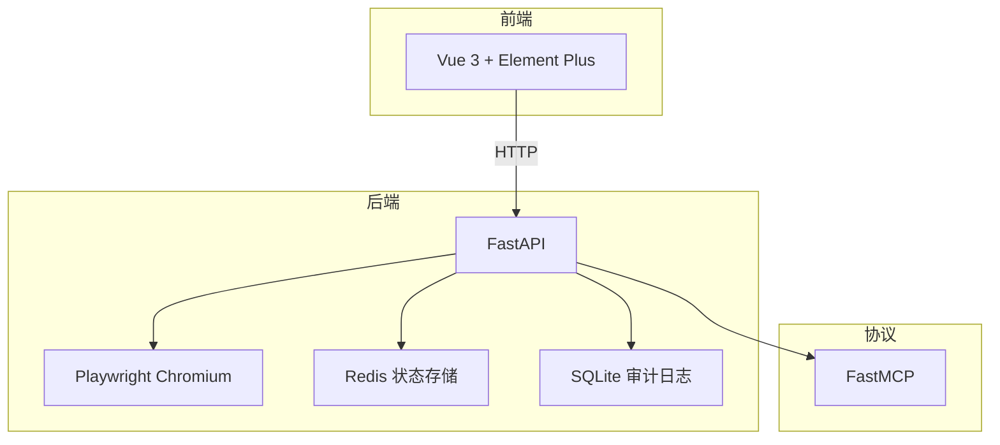

# OmniData

!!! tip "新手上路"
    [快速开始](development/getting-started.md) • [创建爬虫](development/creating-spider.md) • [API 参考](api/spiders.md)

---

## 简介

OmniData 是一个基于 **Playwright** 和 **FastAPI** 的可扩展网页爬虫框架。

### 核心特性

| 特性 | 说明 |
| :--- | :--- |
| **自动注册** | 在 `data_sources/` 下创建爬虫文件即可自动发现 |
| **浏览器池** | 单 Browser + 多 Context 架构，LRU 缓存管理 |
| **登录管理** | 统一的二维码登录管理，状态持久化到 Redis |
| **MCP 协议** | 原生支持 Model Context Protocol，可创建 MCP 服务 |
| **审计日志** | 自动记录爬虫执行日志到 SQLite |
| **Web 界面** | Vue 3 前端，可视化管理爬虫、登录和 MCP 服务 |

---

## 技术栈



- **Python 3.12+** - 核心语言
- **FastAPI 0.128+** - Web 框架
- **Playwright 1.57+** - 浏览器自动化
- **Redis** - 状态持久化
- **SQLite** - 审计日志存储
- **FastMCP** - MCP 协议支持
- **Vue 3** - 前端界面

---

## 快速预览

### 安装

```bash
git clone https://github.com/noimank/OmniData.git
cd OmniData
uv sync
uv run playwright install chromium
```

### 配置

```bash
cp .env.example .env
# 编辑 .env 文件，配置 Redis 连接信息
```

### 启动

```bash
# 启动后端服务
uv run python main.py

# 启动前端服务（另一个终端）
cd frontend && npm run dev
```

访问：
- **后端 API**：`http://localhost:8380`
- **前端界面**：`http://localhost:5173`
- **API 文档**：`http://localhost:8380/docs`

---

## 数据源概览

```bash
curl http://localhost:8380/spiders
```

当前支持 **15+** 个数据源平台：

| 平台 | 接口数 | 类别 |
| :--- | :---: | :--- |
| 东方财富 | 17 | 金融行情 |
| Bilibili | 1 | 视频 |
| 财联社 | 1 | 全球新闻 |
| 富途牛牛 | 1 | 快讯 |
| 和讯网 | 1 | 7x24 快讯 |
| 金融界 | 1 | 快讯 |
| 21财经 | 1 | 快讯 |
| 第一财经 | 1 | 快讯 |
| 华尔街见闻 | 1 | 全球快讯 |
| 新浪财经 | 1 | 国际新闻 |
| 同花顺 | 2 | 资讯/问财 |

查看 [完整数据源列表](datasources/)。

---

## 项目结构

```
omnidata/
├── core/              # 核心框架
│   ├── base_helper.py             # 基础助手类
│   ├── base_web_spider.py         # 爬虫基类
│   ├── base_qr_login.py           # 二维码登录基类
│   ├── browser_context_pool.py    # 浏览器上下文池
│   ├── spider_register.py         # 爬虫自动注册
│   ├── login_register.py          # 登录自动注册
│   └── mcp_manager.py             # MCP 服务管理
├── data_sources/      # 数据源（自动发现）
│   ├── eastmoney/     # 东方财富
│   ├── bilibili/      # Bilibili
│   └── ...
├── database/          # 数据库层
│   ├── models.py      # ORM 模型
│   └── session.py     # 会话管理
├── api/               # FastAPI 应用
│   ├── main.py        # 应用入口
│   └── routers/       # API 路由
├── utils/             # 工具模块
└── frontend/          # Vue 3 前端
```

详见 [系统架构](architecture/)。

---

## 典型用法

### 运行爬虫

```bash
curl -X POST http://localhost:8380/spiders/run \
  -H "Content-Type: application/json" \
  -d '{
    "spider_name": "eastmoney_stock_quote",
    "params": {
      "secucode": "000001"
    }
  }'
```

### 创建 MCP 服务

```bash
curl -X POST http://localhost:8380/api/v1/mcp-services \
  -H "Content-Type: application/json" \
  -d '{
    "name": "my-mcp",
    "description": "我的 MCP 服务",
    "spider_names": ["eastmoney_stock_quote", "sina_global_news"],
    "transport": "streamable-http"
  }'
```

---

## 更多资源

- [系统架构](architecture/) - 了解框架设计
- [开发指南](development/) - 开始开发自己的爬虫
- [数据源](datasources/) - 查看所有支持的数据源
- [API 参考](api/) - API 详细文档
- [常见问题](faq.md) - 常见问题解答

---

## 许可证

MIT License © 2026 [noimank](https://github.com/noimank)
